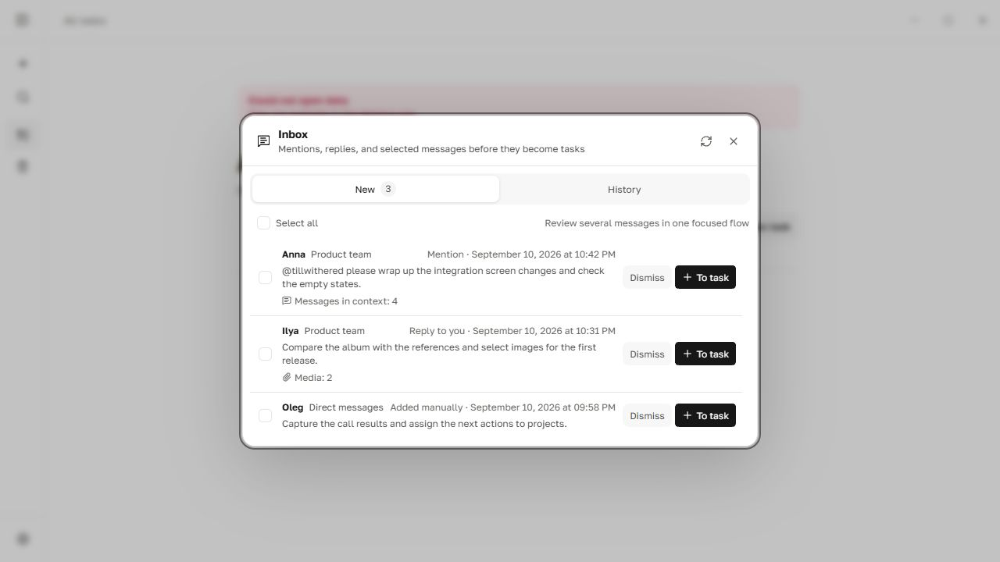
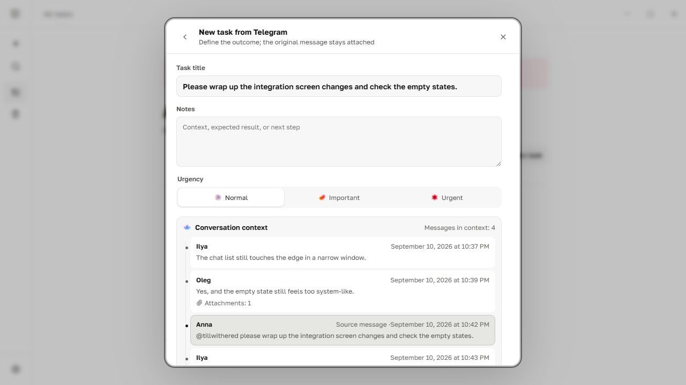
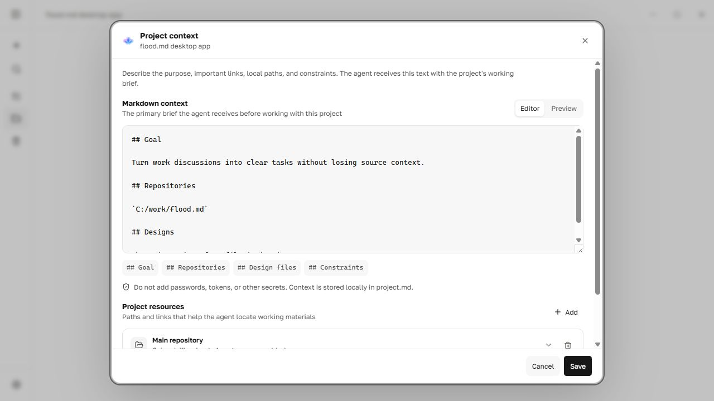
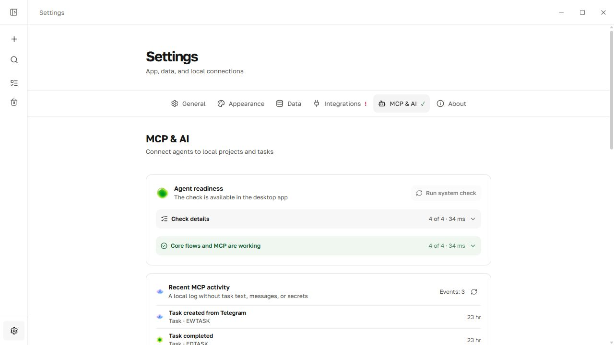

<h1 align="center">flood.md</h1>

<strong>A local task manager for work that starts in chats.</strong>

Turn Telegram discussions into focused Markdown tasks, then give your AI agent the context it needs to help finish them.

<a href="README.md">English</a> · <a href="README.ru.md">Русский</a>

  
  
  
  

<strong><a href="https://github.com/tillwithered/flood.md/releases/latest">Download for Windows</a></strong> · <a href="#quick-start">Quick start</a> · <a href="docs/mcp.md">MCP guide</a>

> **Stable release: 0.1.6.** The current priority is reliability and bug fixes. New features do not have a fixed release schedule.

## From chat to task

A request rarely arrives as a clean ticket. It appears between replies, screenshots, links, and half-finished discussion. flood.md lets an agent inspect a small, relevant part of that conversation instead of loading the entire chat.

1. Link a Telegram chat to a flood.md project.
2. Add project context: Markdown notes, local folders, a read-only GitHub repository, Figma links, or documentation.
3. Ask an MCP-capable agent to review new messages, open nearby replies and screenshots when needed, and create concise prioritized tasks.
4. Later, ask the agent to open a task's work context and help complete it.

Example prompt:

> In the “zakup.io” project, check whether Telegram is fresh. Find clear requests from Dima, open nearby messages, screenshots, and permitted GitHub repositories when needed, then create tasks and assign urgency. Do not duplicate existing work.

### Keep the useful discussion

The task composer keeps the selected message together with the relevant conversation window, author, time, link, and media.

### Give the agent project context

Project instructions and sources are explicit. Access is granted per source; adding a link does not silently grant the agent permission to read it.

## What is included

- **Local Markdown tasks:** readable files remain the source of truth.
- **Telegram through TDLib:** connect a personal account directly, without a bot.
- **A reviewable inbox:** collect mentions, replies, selected messages, or all new messages from chosen chats.
- **Conversation and media context:** preserve discussion windows and Telegram albums; request screenshots only when needed.
- **Read-only GitHub App:** choose repositories and link them to projects without personal access tokens or write permissions.
- **Project context:** Markdown notes, local folders, repositories, Figma files, documentation, and websites.
- **Bundled local MCP server:** manage projects and tasks, triage Telegram, inspect permitted context, and retrieve task work context.
- **Safe storage:** atomic writes, stable IDs, conflict detection, backups, recoverable trash, and duplicate-safe agent operations.
- **Offline core:** projects and tasks keep working without Telegram or a network.

## MCP and AI

The installer includes <code>flood-mcp.exe</code>, a local stdio MCP server for Codex, Claude Desktop, Cursor, and other clients that can launch a local command. The app provides ready-to-copy configurations and a self-check in **Settings → MCP and AI**.

The agent can read bounded Telegram updates, inspect a selected conversation or image, search permitted project sources, preview a task plan, and apply it without creating duplicates. It can also retrieve an existing task together with project and source context before helping with implementation.

A regular cloud ChatGPT conversation cannot launch a local executable; it requires a remotely reachable HTTPS MCP server. flood.md intentionally does not ship that cloud bridge in this local-first release.

Read the [MCP setup, workflows, tool map, and safety model](docs/mcp.md).

## Quick start

1. Download the installer from the [latest release](https://github.com/tillwithered/flood.md/releases/latest). Windows 10 or newer is recommended.
2. Create a project and open **Settings → Integrations**.
3. Connect Telegram by QR code or phone number, then link only the chats you need.
4. Optionally connect the read-only GitHub App and add repositories to the project.
5. Open **Settings → MCP and AI**, choose your client, copy the configuration, and restart that client.

See [what changed in 0.1.6](CHANGELOG.md).

## Privacy and security

- Tasks, attachments, and Telegram sessions stay on the user's device.
- flood.md does not require an account or cloud backend.
- Telegram authorization is stored in TDLib's encrypted local database, outside Markdown and backups.
- GitHub tokens live in the operating system credential store; access is read-only and limited by both the App installation and the repositories linked to a project.
- New or retargeted project sources start with agent access disabled.
- Chat messages, task text, and repository files are untrusted data, not instructions or authority to perform external actions.
- Irreversible MCP deletion is disabled by default.

See [SECURITY.md](SECURITY.md) for the trust model and vulnerability reporting.

## Local data

Projects live in <code>projects/&lt;project-id&gt;/project.md</code>; tasks live in <code>projects/&lt;project-id&gt;/tasks/&lt;task-id&gt;.md</code>. YAML front matter stores explicit metadata while the body remains ordinary Markdown. The default Windows data directory is <code>%APPDATA%\io.flood.desktop</code>; set <code>FLOOD_DATA_DIR</code> to use another location.

## Development

Requirements: Node.js 22, stable Rust, and the [Tauri 2 prerequisites](https://v2.tauri.app/start/prerequisites/).

~~~powershell
npm install
npm run tauri dev
~~~

Official releases receive protected Telegram and updater credentials through GitHub Actions. Independent builds can leave <code>TG_API_ID</code> and <code>TG_API_HASH</code> unset and enter developer-owned values in the app.

~~~powershell
npm run check
cargo test --workspace
npm run tauri build
~~~

## Stack

Tauri 2 · Rust · Svelte 5 · TypeScript · Vite · TDLib · MCP · Markdown

## License

Source is available under the [PolyForm Noncommercial 1.0.0](LICENSE.md) license. Personal and other noncommercial use is permitted; commercial use requires separate permission from the copyright holder.
