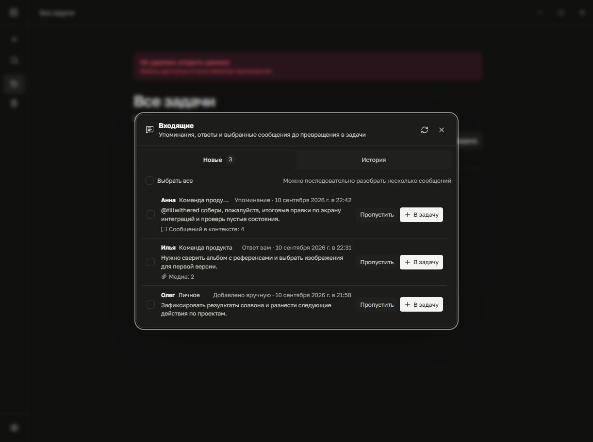
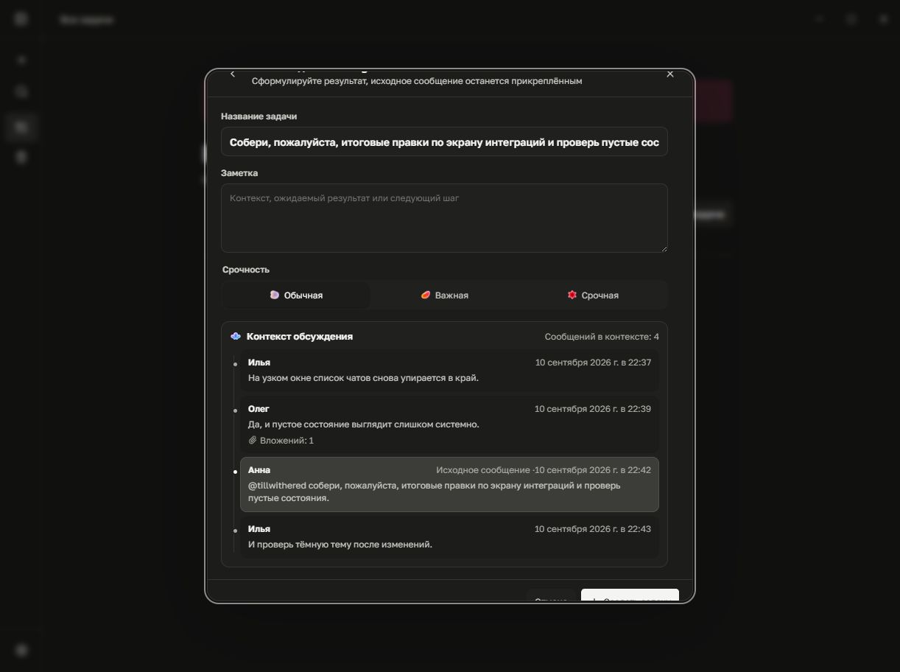
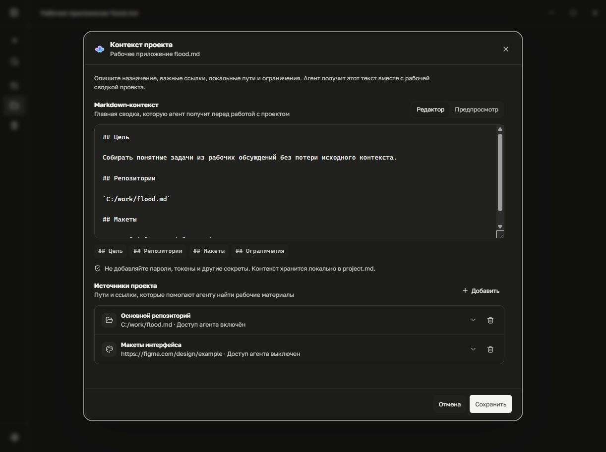
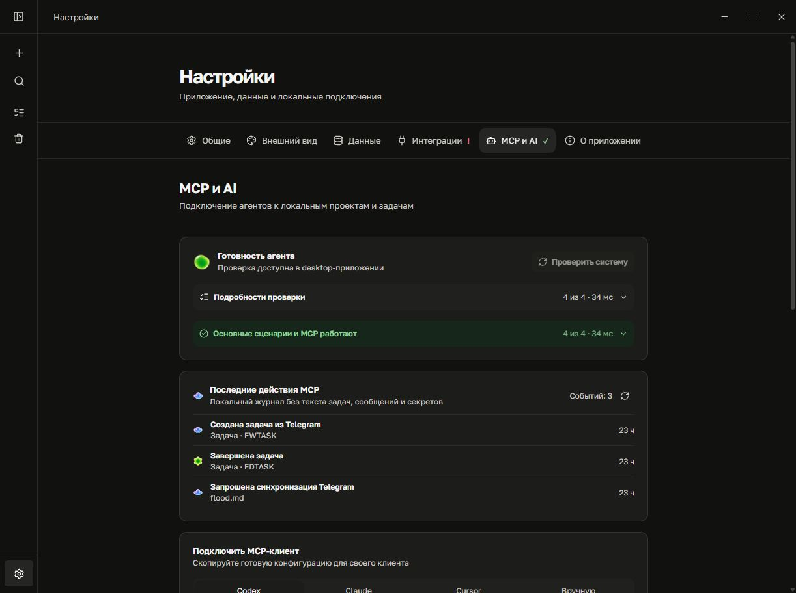

<h1 align="center">flood.md</h1>

<strong>Локальный задачник для работы, которая начинается в чатах.</strong>

Превращайте обсуждения Telegram в понятные Markdown-задачи и давайте AI-агенту контекст, необходимый для их выполнения.

<a href="README.md">English</a> · <a href="README.ru.md">Русский</a>

  
  
  
  

<strong><a href="https://github.com/tillwithered/flood.md/releases/latest">Скачать для Windows</a></strong> · <a href="#быстрый-старт">Быстрый старт</a> · <a href="docs/mcp.ru.md">Инструкция MCP</a>

> **Стабильная версия: 0.1.6.** Сейчас приоритет — стабильность и исправление ошибок. Новые функции выходят без установленного графика.

## От чата к задаче

Поручение редко приходит как готовый тикет. Обычно оно находится между ответами, скриншотами, ссылками и незавершённым обсуждением. flood.md позволяет агенту открыть небольшой релевантный фрагмент разговора вместо загрузки всей переписки.

1. Свяжите Telegram-чат с проектом flood.md.
2. Добавьте контекст проекта: Markdown-описание, локальные папки, read-only GitHub-репозитории, Figma или документацию.
3. Попросите MCP-агента проверить новые сообщения, при необходимости открыть соседние реплики и скриншоты, а затем создать компактные задачи с приоритетами.
4. Позже агент сможет открыть рабочий контекст задачи и помочь с её выполнением.

Пример запроса:

> В проекте «zakup.io» проверь свежесть Telegram. Найди явные поручения от Димы, при необходимости открой соседние сообщения, скриншоты и разрешённые GitHub-репозитории. Создай задачи, расставь срочность и не дублируй существующие.

### Сохранить полезную часть обсуждения

В задаче остаются выбранное сообщение, релевантные соседние реплики, авторы, время, ссылка и медиа.

### Дать агенту контекст проекта

Инструкции и источники проекта задаются явно. Доступ включается отдельно для каждого источника: добавленная ссылка сама по себе не разрешает агенту её читать.

## Что уже входит

- **Локальные Markdown-задачи:** читаемые файлы остаются источником правды.
- **Telegram через TDLib:** подключение личного аккаунта напрямую, без бота.
- **Входящие для разбора:** упоминания, ответы, выбранные вручную или все новые сообщения нужных чатов.
- **Контекст и медиа:** сохранение фрагмента обсуждения и Telegram-альбомов; скриншоты запрашиваются только при необходимости.
- **Read-only GitHub App:** выбор репозиториев без персональных токенов и прав на запись.
- **Контекст проекта:** Markdown, локальные папки, репозитории, Figma, документация и сайты.
- **Встроенный локальный MCP:** управление проектами и задачами, разбор Telegram, чтение разрешённых источников и получение рабочего контекста задачи.
- **Надёжное хранение:** атомарная запись, стабильные ID, защита от конфликтов и дублей, резервные копии и восстанавливаемая корзина.
- **Офлайн-основа:** проекты и задачи работают без Telegram и интернета.

## MCP и AI

Установщик содержит <code>flood-mcp.exe</code> — локальный stdio MCP-сервер для Codex, Claude Desktop, Cursor и других клиентов, умеющих запускать локальную команду. В **Настройки → MCP и AI** есть готовые конфигурации и самопроверка.

Агент может читать Telegram небольшими порциями, открывать выбранное обсуждение или изображение, искать в разрешённых источниках проекта, показывать план задач перед записью и применять его без дублей. Для существующей задачи он получает её описание вместе с контекстом проекта и источников.

Обычный облачный чат ChatGPT не может запустить локальный исполняемый файл: ему требуется доступный по HTTPS remote MCP-сервер. В локальной версии flood.md такой облачный мост намеренно отсутствует.

Подробнее: [настройка MCP, сценарии, карта инструментов и модель безопасности](docs/mcp.ru.md).

## Быстрый старт

1. Скачайте установщик из [последнего релиза](https://github.com/tillwithered/flood.md/releases/latest). Рекомендуется Windows 10 или новее.
2. Создайте проект и откройте **Настройки → Интеграции**.
3. Подключите Telegram по QR-коду или номеру телефона и свяжите только нужные чаты.
4. При необходимости подключите read-only GitHub App и добавьте репозитории в проект.
5. Откройте **Настройки → MCP и AI**, выберите клиент, скопируйте конфигурацию и перезапустите его.

[Что изменилось в версии 0.1.6](CHANGELOG.md).

## Приватность и безопасность

- Задачи, вложения и Telegram-сессия остаются на устройстве пользователя.
- Для работы не нужен аккаунт flood.md или облачный backend.
- Авторизация Telegram хранится в зашифрованной локальной базе TDLib отдельно от Markdown и резервных копий.
- Токены GitHub находятся в системном хранилище учётных данных; доступ read-only ограничен установкой GitHub App и репозиториями, связанными с проектом.
- Для нового или изменённого источника доступ агента по умолчанию выключен.
- Сообщения, задачи и файлы репозитория считаются недоверенными данными, а не инструкциями или разрешением на внешние действия.
- Необратимое удаление через MCP по умолчанию отключено.

Подробнее: [SECURITY.md](SECURITY.md).

## Локальные данные

Проекты находятся в <code>projects/&lt;project-id&gt;/project.md</code>, задачи — в <code>projects/&lt;project-id&gt;/tasks/&lt;task-id&gt;.md</code>. Явные метаданные хранятся в YAML front matter, а описание остаётся обычным Markdown. Каталог Windows по умолчанию: <code>%APPDATA%\io.flood.desktop</code>; его можно изменить через <code>FLOOD_DATA_DIR</code>.

## Разработка

Потребуются Node.js 22, стабильный Rust и [зависимости Tauri 2](https://v2.tauri.app/start/prerequisites/).

~~~powershell
npm install
npm run tauri dev
~~~

Официальные релизы получают защищённые параметры Telegram и updater через GitHub Actions. В самостоятельной сборке можно оставить <code>TG_API_ID</code> и <code>TG_API_HASH</code> пустыми и ввести собственные параметры в приложении.

~~~powershell
npm run check
cargo test --workspace
npm run tauri build
~~~

## Стек

Tauri 2 · Rust · Svelte 5 · TypeScript · Vite · TDLib · MCP · Markdown

## Лицензия

Исходный код доступен по лицензии [PolyForm Noncommercial 1.0.0](LICENSE.md). Личное и другое некоммерческое использование разрешено; для коммерческого использования требуется отдельное разрешение правообладателя.
